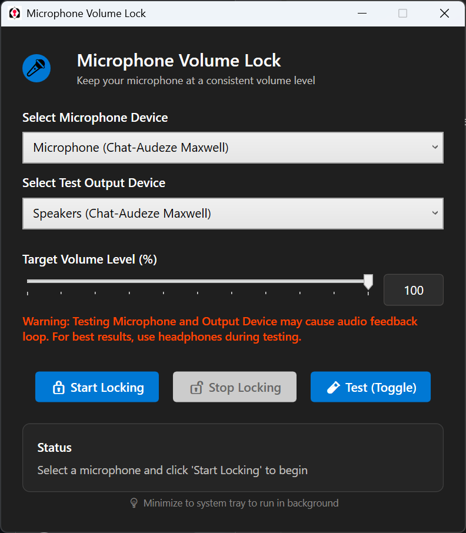
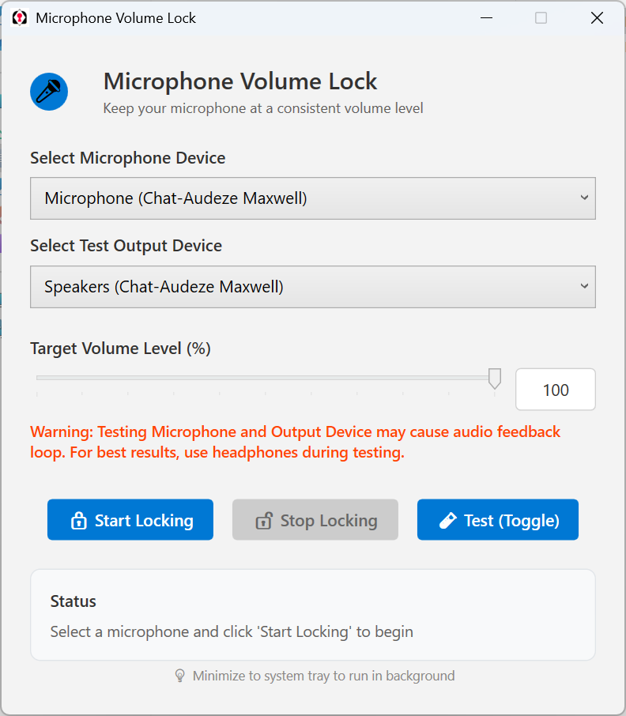
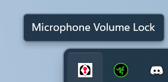

# MicrophoneLock
This is a simple, self contained, Windows 11 targeted .exe that allows Users to set microphone levels to a specified value between 0 and 100 - and keep it there!

Consider verifying with the included hash using the following in PowerShell: Get-FileHash "\path\to\MicrophoneLock.exe" -Algorithm SHA256

Users will likely be stopped by Windows SmartScreen on launch. To get around this, select "More information" when the warning appears and then click "Run anyway"

A few tech things about this app: I built this targeting Any CPU and .NET 8.0. I bundled it as a standalone .exe, so you do not need to "install" it and all its dependencies are included. The app does NOT need Administrator priveleges to run, and I am leveraging NAudio for the locking functionality (check the source code out for yourself). I have found success in my own limited testing, but please feel free to report issues or fork and improve. I am not a developer.

It supports both light and dark themes (it should autodetect and set accordingly), and you can minimize it to the tray for ease of use.

Here are some example screenshots below:

Dark Mode Interface:
  

Light Mode Interface:
  

Tray Icon:

